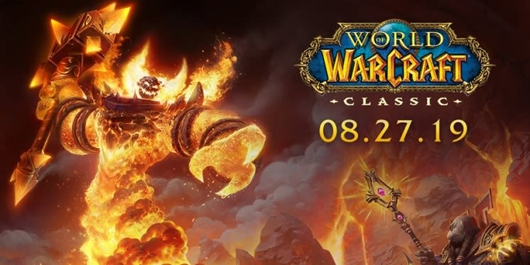
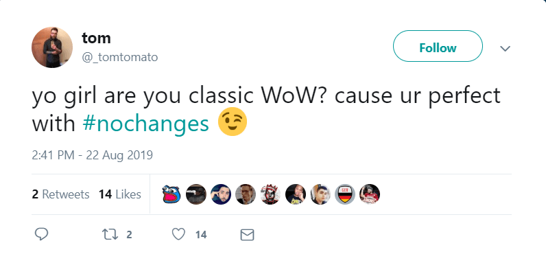
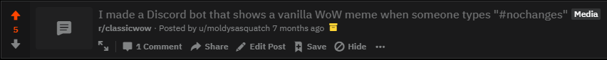
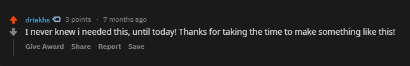
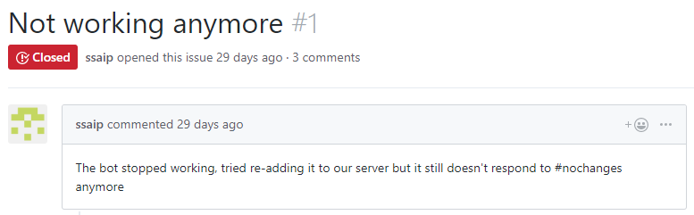
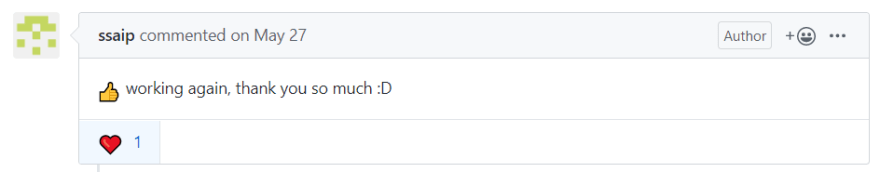
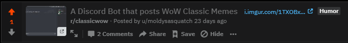
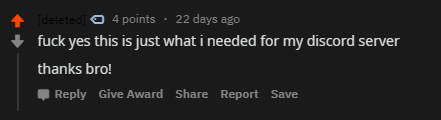
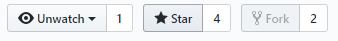

_A tale about World of Warcraft memes and catering to an audience_

Side projects remind me of why I love software development - we have the ability to conjure products from nothing, with minimal upfront costs. In this side project, the most rewarding part has actually been bundling it and making it accessible to the public with a beautiful readme. Why is this my favorite part? Am I a man of the people? **No.** I just want GitHub stars.

So as the man I am, a seeker of GitHub stars, I went on and decided my best action was to try to appeal to a niche community that I relate with; as Mark Twain said, "Write what you know." The answer was obvious: I was going to build something that related to World of Warcraft.



To give some context, I played the 'Classic' version of WoW as a kid. Blizzard was going to be re-releasing WoW: Classic, and I was absolutely ecstatic. I wasn't the only one; I'd been closely following [/r/classicwow](https://www.reddit.com/r/classicwow/), which was popping off in anticipation for the release date. I noticed that the subreddit had become a pool of memes. And that's when I knew what I had to do.

Memes perform so well on this subreddit, it's absurd. Even when Blizzard has gone months without putting out an update, the community continues to churn out these memes.

So, knowing this was trending, **I decided to make a Discord Bot that you can ping for WoW Classic memes.**

##Creating the Bot



_**\#nochanges**: a debate/joke within the community that ignites arguments and memes. It refers to the suggestion that the re-release of the 2006 version should come with some changes._

#### So what does the bot look like?

When someone types _#nochanges_, the bot sends a meme scraped from /r/classicwow.


#### What did I use to build it?

* Python + JavaScript/Node.js
* A hosting platform (at first, I used a sketchy free platform, but eventually I moved to an AWS EC2 instance)
* PRAW (a Python Reddit API wrapper)
* Discord.js (a JavaScript Discord API wrapper)


On the Python side of things, I have a script that fetches the subreddit for image posts above 20 upvotes and writes them to a .csv file. We'll use this to grab our memes.

```python
with open('imageLinks.csv','a') as csvFile:
    for post in reddit.subreddit('classicwow').top('week', limit=None):
        if (post.score > 20 and 'imgur.com' in post.url
        or 'i.redd.it' in post.url
        or 'redditmedia.com' in post.url
        or 'gfycat.com' in post.url):
            try:
                csvFile.write(post.title + ', ' + post.url + '\n')
            except UnicodeEncodeError:
                pass
```

Running this script will generate a .csv that looks like:
```
Blizzard added a Thex NPC to retail!, https://i.redd.it/br40nn345hg31.png
Soon in wow classic!, https://i.redd.it/i5uk9lojefc31.jpg
Everyone in this Subreddit right now, https://i.redd.it/ig4cpkh4c7g31.jpg
Blessed be the Paladins, https://i.redd.it/rzr69wqr7uf31.jpg
Nothing new, https://i.redd.it/zwwi6owb4vc31.png
"Let's just wait until they pull another mob...", https://i.redd.it/m1bqdby4uqa31.png
Blizzard HQ, September 4., https://i.redd.it/vw4xa35x1td31.jpg
...
```

The JavaScript/Node side handles user request. So when a user types '#nochanges' or '#meme', we reply with a random line grabbed from our .csv file.

```javascript
client.on('message', message => {
  message.content = message.content.toLowerCase();
  switch(message.content) {

    /* Send meme to channel */
    case '#nochanges':
    case '#meme':
      dailyMemeCount++
      getRandomLine('imageLinks.csv', (returnValue) => {
        message.channel.send(returnValue);
        return;
      });
      break;

```
I really thought that if I could make a beautiful readme and post it on the subreddit, I would rake in the GitHub stars. I was definitely wrong... but I still ended up getting users! Here's the story.

Advertising the Bot
So, after getting the bot up and running on a weird, free hosting platform, I tried posting about it on /r/classicwow...



As you can see, it reached an impressive 5 points... which is pretty awful considering the front page posts of this subreddit easily reach over 1,000. This was pretty demotivating, especially after thinking it was such a good idea. "This community LOVES memes, surely it'll do well!"

However, something amazing did happen - a comment that hit my heart:



Oh my, someone liked my bot? And thanked me, on the Internet? People rarely go out of their way to thank someone online, but user drtakhs went out there and did it, and it made me feel AMAZING. I felt like a superhero, a Santa Claus of World of Warcraft memes.

---

Months Later, I'm still using that sketchy free hosting platform, and I almost entirely forgot about this side project. I wake up to an email from GitHub about a new issue on one of my repos:



Could it be? Have I let the people down? They requested memes but what did they get? NOTHING.

It became my mission to appease this random person on the internet. Thanks to GitHub user ssaip, I updated the bot and redeployed it using an AWS EC2 instance. Making this change had the bot up and running with much fewer server hiccups.



They even ended up thanking me after the issue was resolved. Recognition and a sense of community through the people using the bot has been by far my favorite part of this whole project.

With the bot back up, I thought to take a gander at the stats. Were people actually adding the bot to their Discord servers? Maybe it was just ssaip…

Nope. It was **159 Discord Servers**, totaling **10k+ users**. What? You're telling me I've been letting all of these people down, too?

With the realization that more people used it that I thought, I figured I should try advertising on the subreddit again. Everybody loves a repost, right?



Yup, did even worse. But again, another comment made my day:



#### So, what happened next?

I continued to build upon the bot, and even made a product page website to advertise for it:

https://www.connormulqueen.com/Mechanical-Squirrel/

I also added some MVP2 features. Now, the bot:

* Uses the node-scheduler npm package to automatically run the Python script that scrapes /r/classicwow on a weekly basis
* Messages me when it joins a new server
* Integrates with DiscordBots API by providing my server count to one of their endpoints
    * Goal: comply with DiscordBot's visibility algorithm and drive more traffic to my page


## Conclusion
As of this writing, I'm at **503 servers**, amounting to **~55,839 users**!

I checked back in with my original goal - the mission to collect stars on my GitHub repo.



I ended up getting 4 stars. 3 of which came from friends, and 1 of which came from my brother. Not all stories have happy endings, but maybe I just didn't have the right goal?

[My discord bot website](https://www.connormulqueen.com/Mechanical-Squirrel/)

[Discord bot repo](https://github.com/ConnorMulqueen/Mechanical-Squirrel)